# Dimension Reduction and Clustering Operations With a Dataset Created Using RNA Sequence Data.

The dataset used in this project was preprocessed for use in the k-means clustering algorithm 
by performing dimension reduction using PCA and SVD algorithms. 

## Dataset

A dataset of single-cell RNA sequencing data of mouse Hematopoietic Stem/Cell (HSPC) collected
in 2016 by Nestorova et al. is available. The "Single Cell RNA Seq Nestorova2016 Mouse HSPC"
dataset provides a genes x cells matrix, also known as a "count matrix," which shows the
expression level of each gene in each cell.

For further information about the dataset and other related studies, please refer to:
[Single Cell RNA Sequnce](https://www.kaggle.com/datasets/alexandervc/single-cell-rna-seq-nestorova2016-mouse-hspc)

## [Results](results)

The dataset used was reduced to 3 (PCA-0, SVD-0), 5 (PCA-1, SVD-1), and 10 (PCA-2, SVD-2) 
features, and clustering was performed separately on each reduced dataset. The results were 
visualized in both 2D and 3D.

### PCA

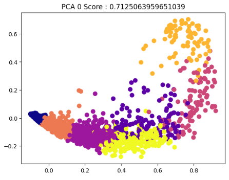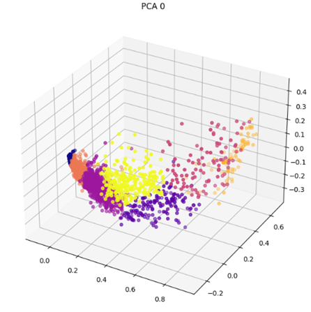 

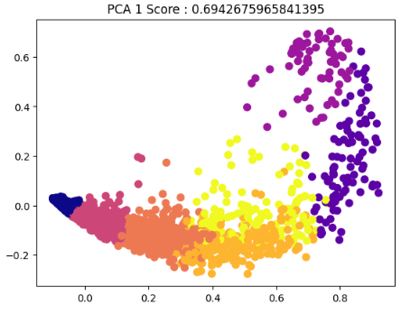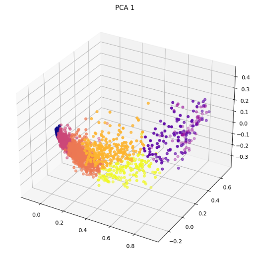 

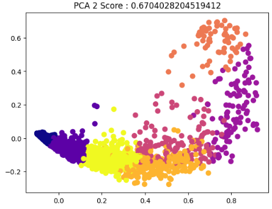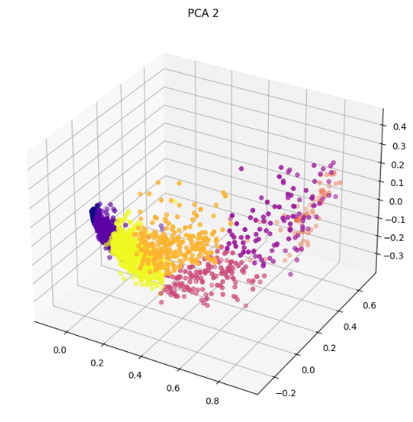 

### SVD

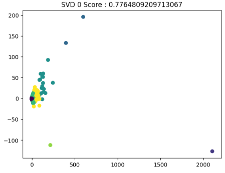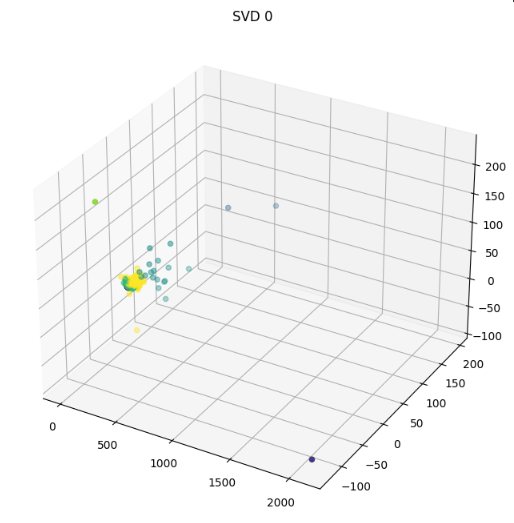 

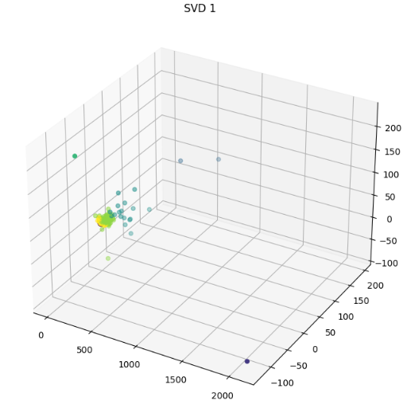 

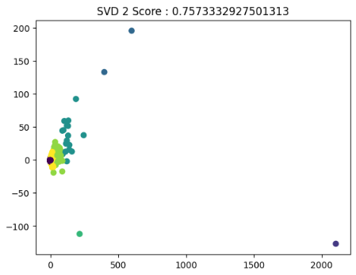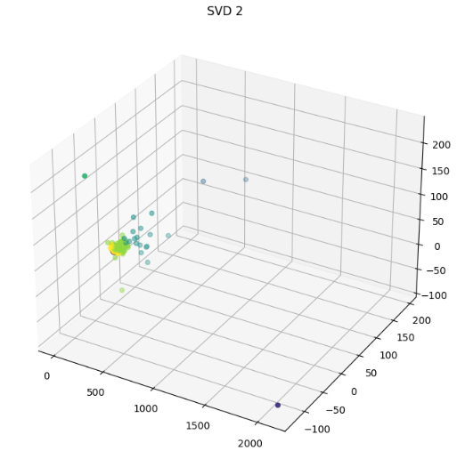 
